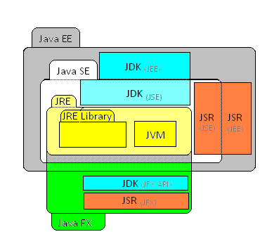
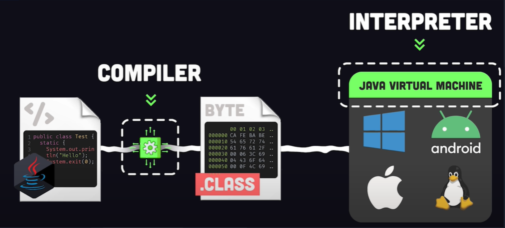

# Requierements

- Generate template from https://start.spring.io/
- Install Java JDK 11
- Install MySQL DB, lancer la base de données MySQL `docker-compose up`
- export JAVA_HOME=/usr/lib/jvm/java-11-openjdk-amd64/

# Besoins

- GET /countries => La liste de tous les pays
- GET /country/{id} => Les informations du pays portant cet id
- POST /country => Enregistre un pays
- PUT /country/{id} => Met à jour un pays portant cet id
- DELETE /country/{id} => Supprime le pays portant cet id
- Le retour des requêtes doit être formalisé en JSON
- Pour me GET lorsque la requête ne trouve pas les informations, le format retourné doit être de cette forme `{"id":null,"code":"Impossible d'obtenir le pays portant l'identifiant 1","name":"ERROR"}`
- Mettre en place une validation des champs du Bean (le code doit être sur 2 caractères en majuscule)
- Retourner un JSON qui contient le message correspondant au type d'erreur

# Java

- Version gratuite OpenJDK, depuis le rachat par Oracle
- Version entreprise Jakarta EE, ancienne J2EE

- Java Runtime Environnement permet d'avoir les outils nécessaires à l'interprétation du bytecode
- Java Virtual Machine est l'interpéteur qui lie le langage machine
- Java Development Kit est une suite de librairie pour construire son application Java
- Le Java un langage compilé qui génère du bytecode (.class) pour que la JVM puisse interprété le langage machine

# Launch

`./mvnw clean compile spring-boot:run`

# Compile package JAR

`./mvnw package` et le JAR est dispo dans le dossier target

On lance l'application par la commande `java -jar target/api-0.0.1-SNAPSHOT.jar`

# Commandes

- POST

`curl -X POST localhost:8080/country -H 'Content-type:application/json' -d '{"name": "France", "code": "FR"}'`

- GET pour tous les pays

`curl -X GET localhost:8080/countries`

- GET pour 1 pays

`curl -X GET localhost:8080/country/1 -H 'Content-type:application/json'`

# Resources

- https://spring.io/guides/gs/rest-service/
- https://spring.io/guides/tutorials/rest/
